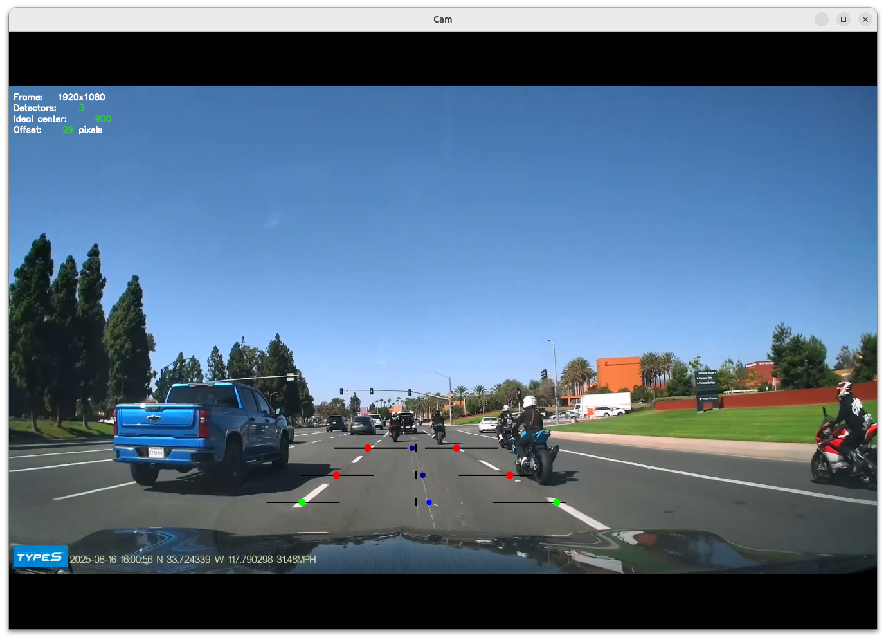

# Self-driving care lane detector



Lane detector in real-time using Kivy + OpenCV. The plan is to move this application to Android, hence the choice of Kivy.

## Principle

We use "detectors" (black line in example image). It detects transitions from darker to brighter areas and back. We position them to correctly accomodate perspective shift. Each detector smoothly finds the best candidate in its area of search. Then we take the best detected.

## Usage

Example usage:

```
python main.py ~/Downloads/videoplayback.mp4   --detectors 800,860,920   --center-x 900   --search-half-width 80   --lowest-detector-offset 250   --highest-detector-offset 100   --threshold-offset 40   --min-bright-width 5   --smoothing-window 21   --min-dark-light-jump 35
```

For this [youtube video](https://www.youtube.com/watch?v=sabZ4Ce4R00).